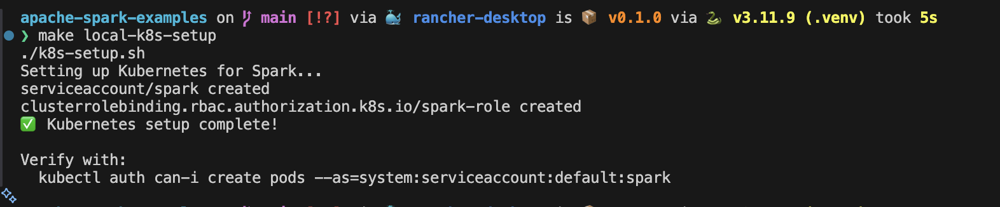
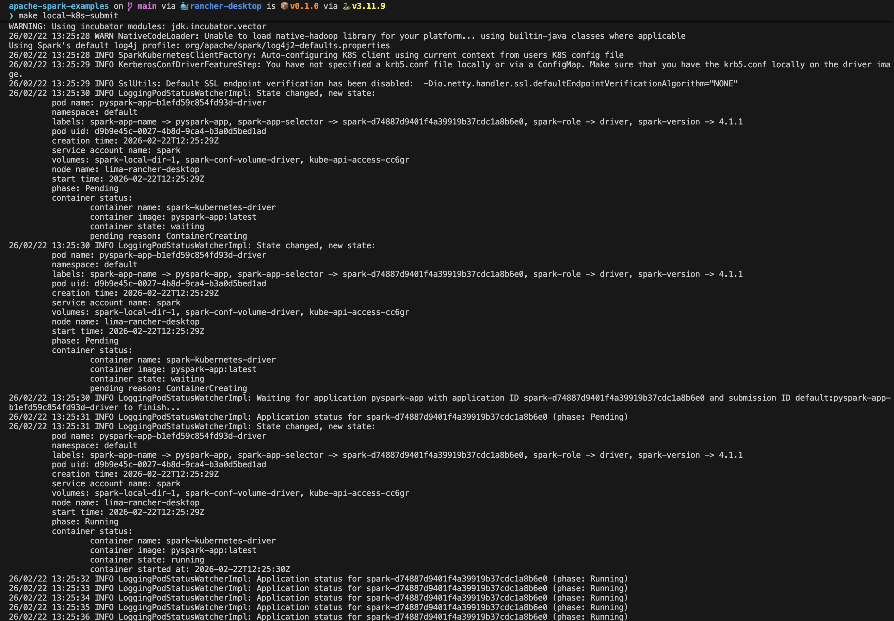
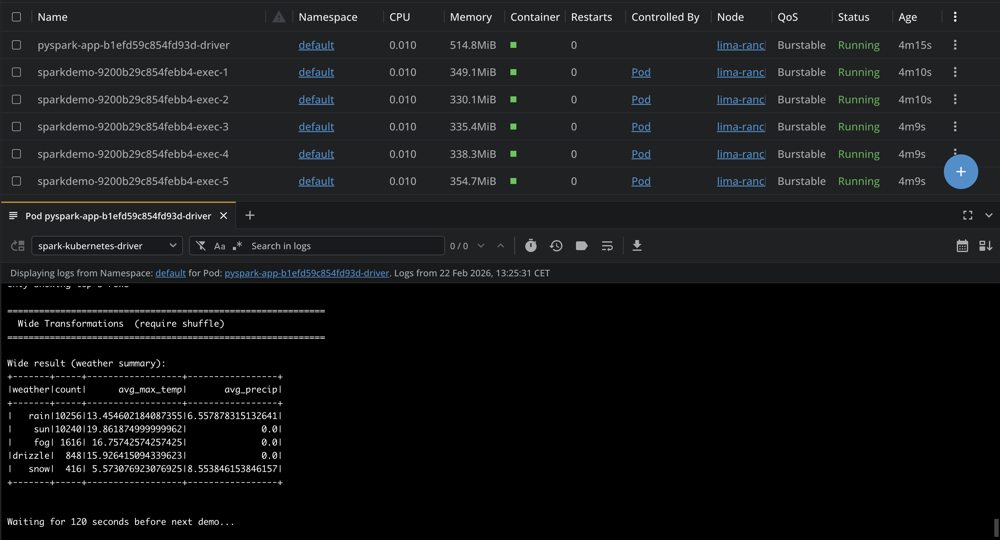
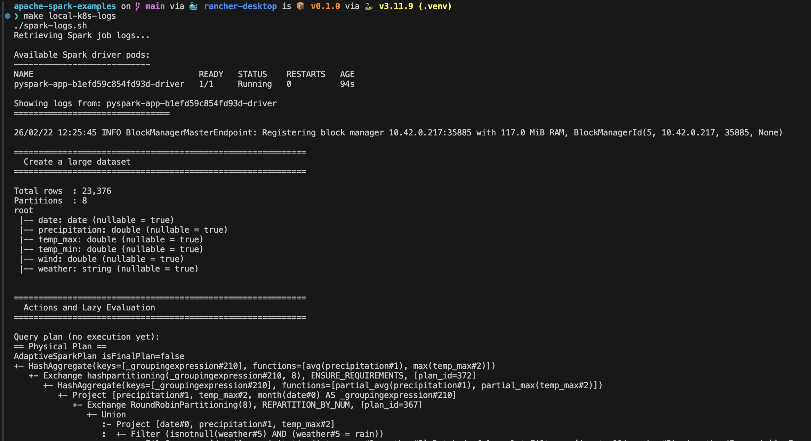
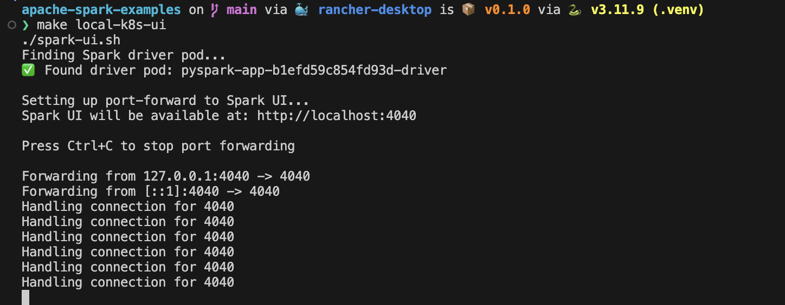
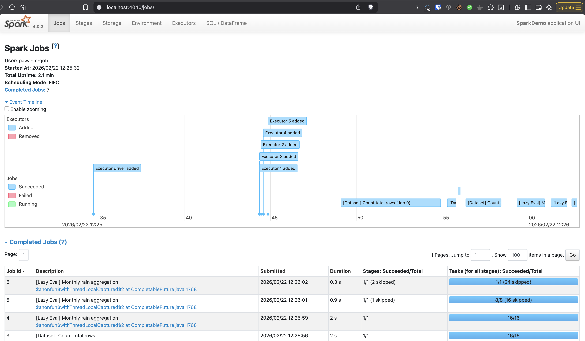
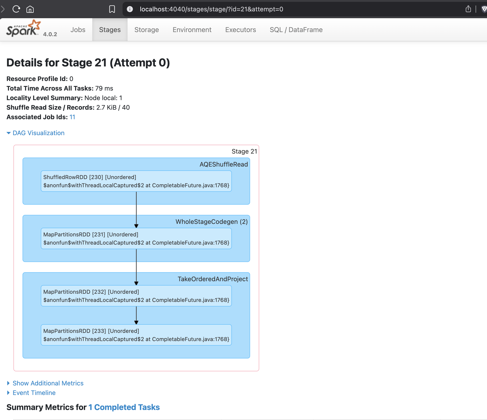
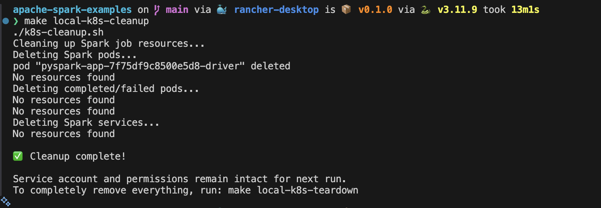
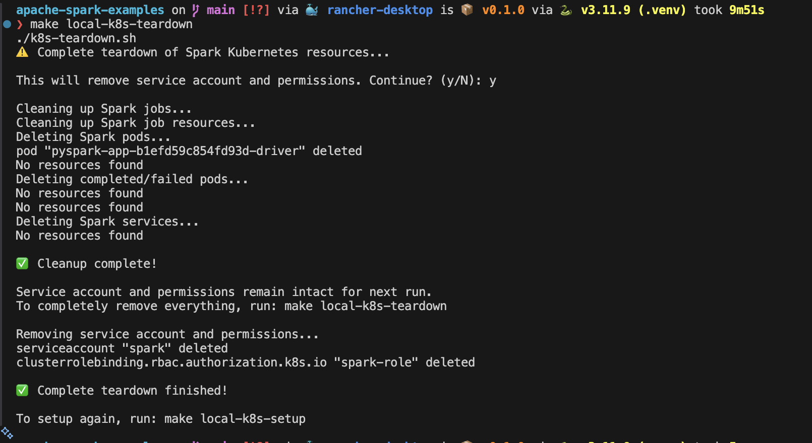

# Deploying PySpark to Kubernetes

This guide explains how to build a Docker image and deploy your PySpark application to a Kubernetes cluster.

> The result of your job will be visible in the logs of your spark-driver, 
> Or you can also check in port 4040 of spark-driver container

## Prerequisites

- Docker installed (or Rancher Desktop)
- Access to a Kubernetes cluster (or Rancher Desktop's built-in K8s)
- kubectl configured
- Spark binaries (for spark-submit)
- Docker registry access (only if deploying to remote cluster)

## Quick Start

### Preequisities

**1. Initialize project:**
```bash
# Initialises venv and install requirements.txt and other project related dependencies like pyspark
make init
```

**2. Install apache-spark:**
```bash
# for Mac OS
brew install apache-spark
```
Or download from: https://spark.apache.org/downloads.html

### For Rancher Desktop (Local Development)

**1. Setup Kubernetes permissions:**
```bash
# Create service account and permissions (only needed once)
make local-k8s-setup
```

**2. Build the image locally:**
```bash
# Simple - uses defaults (pyspark-app:latest)
make docker-build
```

**3. Submit directly to Rancher Desktop's K8s:**
```bash
make local-k8s-submit
```

That's it! No registry push needed since Rancher Desktop's Kubernetes can access local Docker images.

## Quick Reference (Makefile Commands)

```bash
# One-time setup
make init                  # Initialize Python environment
make local-k8s-setup      # Setup Kubernetes service account

# Build and deploy
make docker-build         # Build Docker image
make local-k8s-submit    # Submit Spark job to K8s

# Monitoring
make local-k8s-status    # Check Spark pods and services
make local-k8s-ui        # Access Spark UI (while job is running)
make local-k8s-logs      # View completed job logs

# Cleanup
make local-k8s-cleanup   # Remove Spark jobs (keeps service account)
make local-k8s-teardown  # Complete teardown (removes everything)
```

## Command Examples:
`make local-k8s-setup`


---
`make local-k8s-submit`




---
`make local-k8s-logs`


---
`make local-k8s-ui`






---
`make local-k8s-cleanup`


---
`make local-k8s-teardown`



### For Remote Kubernetes Cluster

**1. Build the Docker Image**

```bash
# Build with default settings
make docker-build

# Or build with custom settings
make docker-build IMAGE_NAME=my-spark-app IMAGE_TAG=v1.0.0
```

**2. Push to Registry**

```bash
# Push to default registry (localhost:5000)
make docker-push

# Or push to custom registry
make docker-push REGISTRY=myregistry.azurecr.io IMAGE_NAME=my-spark-app IMAGE_TAG=v1.0.0
```

**3. Build and Push in One Command**

```bash
make docker-all REGISTRY=myregistry.io IMAGE_NAME=pyspark-app IMAGE_TAG=v1.0.0
```

**4. Update spark-submit.sh:**
- Change K8S_MASTER to your cluster's API server
- Update IMAGE_NAME to include your registry
- Remove or change `imagePullPolicy` (use `Always` or `IfNotPresent`)

## Submit to Kubernetes

### Option 1: Use the provided script

Edit `spark-submit.sh` with your configuration:
- K8s API server URL
- Image name and registry
- Resource requirements

Then run:
```bash
./spark-submit.sh
```

### Option 2: Manual spark-submit

```bash
spark-submit \
    --master k8s://https://your-k8s-api:6443 \
    --deploy-mode cluster \
    --name my-pyspark-job \
    --conf spark.executor.instances=3 \
    --conf spark.kubernetes.container.image=myregistry.io/pyspark-app:v1.0.0 \
    --conf spark.kubernetes.pyspark.pythonVersion=3 \
    --conf spark.kubernetes.namespace=default \
    --conf spark.executor.memory=2g \
    --conf spark.driver.memory=2g \
    local:///opt/spark/work-dir/src/your_app.py
```

## Docker Image Structure

The image contains:
- Base: Apache Spark with Python support
- Working directory: `/opt/spark/work-dir`
- Application code: `/opt/spark/work-dir/src/`
- Dependencies installed from poetry

## Important Notes

### Image Pull Policy

- **Rancher Desktop / Local**: Use `imagePullPolicy=Never` to prevent K8s from trying to pull from remote registry
- **Remote Cluster**: Use `imagePullPolicy=Always` or `imagePullPolicy=IfNotPresent`

The `spark-submit.sh` is configured for Rancher Desktop by default.

### File Paths in spark-submit

When referencing application files, use the `local://` prefix with the path inside the container:
```
local:///opt/spark/work-dir/src/demo.py
```

### Kubernetes Service Account

Ensure Spark has permissions in your K8s cluster:

```bash
kubectl create serviceaccount spark
kubectl create clusterrolebinding spark-role \
    --clusterrole=edit \
    --serviceaccount=default:spark \
    --namespace=default
```

### Resource Configuration

Adjust these based on your needs:
- `spark.executor.instances`: Number of executor pods
- `spark.executor.memory`: Memory per executor
- `spark.driver.memory`: Memory for driver
- `spark.executor.cores`: Logical CPU cores Spark uses for parallelism per executor
- `spark.kubernetes.driver.request.cores`: Kubernetes CPU resource request for driver
- `spark.kubernetes.executor.request.cores`: Kubernetes CPU resource request per executor

**Local Development (Rancher Desktop):**
The default `spark-submit.sh` configuration:
- **5 executors** (`EXECUTOR_INSTANCES=5`)
- **512MB memory** per pod (driver and executor)
- **3 logical cores** per executor for Spark parallelism
- **0.1 CPU cores** requested for driver (Kubernetes request)
- **0.1 CPU cores** requested per executor (Kubernetes request)

**Total Kubernetes CPU requests:** 0.1 (driver) + (5 × 0.1 executors) = 0.6 cores

**Note:** Low CPU requests (0.1) allow multiple pods to share limited local resources. Logical cores (3) control Spark's parallelism but don't directly map to Kubernetes resource requests.

**If you get "Insufficient cpu" errors:**
1. Reduce executor count: `EXECUTOR_INSTANCES=1` in spark-submit.sh
2. Or increase Rancher Desktop resources:
   - Preferences → Resources → CPU (increase to 4+)
   - Preferences → Resources → Memory (increase to 8GB+)

**Production:**
For production clusters, increase resources in spark-submit.sh:
```bash
EXECUTOR_INSTANCES=10-20
spark.executor.memory=4g-8g
spark.driver.memory=2g-4g
spark.executor.cores=4-8
spark.kubernetes.driver.request.cores=1-2
spark.kubernetes.executor.request.cores=2-4
```

**Understanding CPU settings:**
- `spark.executor.cores`: Logical cores Spark uses for parallelism (per executor)
- `spark.kubernetes.driver.request.cores`: Kubernetes CPU resource request for driver pod (can be fractional like 0.1)
- `spark.kubernetes.executor.request.cores`: Kubernetes CPU resource request for executor pod (can be fractional like 0.1)

## Monitoring and Accessing Spark UI

### Access Spark UI (while job is running)

The Spark UI is only available while the job is running. To access it:

In a new terminal session
```bash
# Option 1: Use the helper script
make local-k8s-ui
# Or: ./spark-ui.sh

# Option 2: Manual port-forward
kubectl port-forward -n default <driver-pod-name> 4040:4040
```

Then open in your browser: **http://localhost:4040**

The UI shows:
- Job progress and stages
- Executor status and tasks
- SQL queries and DAG visualization
- Storage and environment info

**Note:** The UI stops when the job completes.

### View logs after job completion

```bash
# View logs from the most recent job
make local-k8s-logs
# Or: ./spark-logs.sh

# View logs from a specific pod
kubectl logs -n default <driver-pod-name>

# Follow logs in real-time
kubectl logs -n default <driver-pod-name> -f

# View executor logs
kubectl logs -n default <executor-pod-name>
```

### Check job status

```bash
# Check all Spark pods and services
make local-k8s-status

# List all pods with details
kubectl get pods -n default -l spark-role

# Describe a pod for detailed info
kubectl describe pod <pod-name> -n default
```

## Troubleshooting

### Insufficient CPU/Memory errors
```bash
# Check available resources
kubectl describe nodes

# Current configuration uses minimal CPU:
# - Driver requests: 0.1 cores
# - Each executor requests: 0.1 cores
# - With 5 executors: Total = 0.6 cores
# This fits comfortably on 1 CPU

# If still insufficient:
# 1. Reduce executors: Edit EXECUTOR_INSTANCES=1 in spark-submit.sh
# 2. Or increase Rancher Desktop: Preferences → Resources → CPU (2+)
```

### Pod stuck in Pending state
```bash
# Check why pod can't be scheduled
kubectl describe pod <pod-name> -n default

# Look for events at the bottom showing:
# - Insufficient CPU/Memory
# - Image pull errors
# - Volume mount issues
```

### Job fails or crashes
```bash
kubectl logs <driver-pod-name> -n default
```

### Describe pod for errors
```bash
kubectl describe pod <driver-pod-name> -n default
```

## Cleanup

### Clean up between runs (keeps service account)
Use this to clean up Spark jobs while keeping the service account and permissions intact for the next run:

```bash
# Remove all Spark pods and services
make local-k8s-cleanup
# Or run directly:
./k8s-cleanup.sh
```

This removes:
- All Spark driver and executor pods
- Completed/failed pods
- Spark services

**The service account and permissions remain**, so you can submit new jobs immediately.

### Complete teardown (removes everything)
Use this only when you want to completely remove all Spark infrastructure:

```bash
# Complete teardown with confirmation prompt
make local-k8s-teardown
# Or run directly:
./k8s-teardown.sh
```

This removes everything including:
- All Spark jobs (via cleanup)
- Service account
- Cluster role bindings

After teardown, you'll need to run `make local-k8s-setup` again before submitting new jobs.

### Remove specific pods
```bash
# Delete by label
kubectl delete pods -l spark-role=driver --namespace=default
kubectl delete pods -l spark-role=executor --namespace=default
```

## Examples

Run the caching example:
```bash
# Update spark-submit.sh to use caching.py (default)
./spark-submit.sh
```

Run sample.py:
```bash
# Edit spark-submit.sh and change APP_FILE to:
# APP_FILE="local:///opt/spark/work-dir/src/sample.py"
./spark-submit.sh
```
