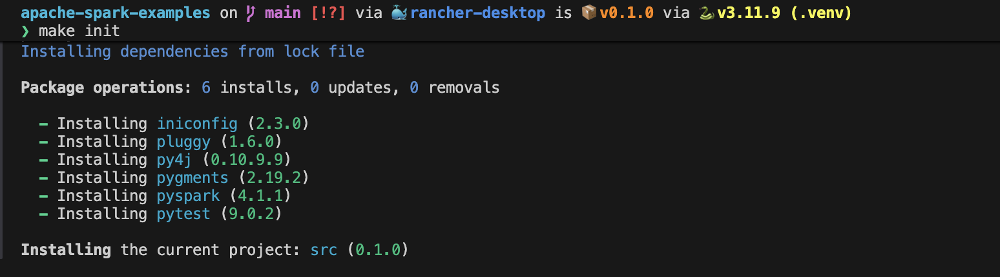
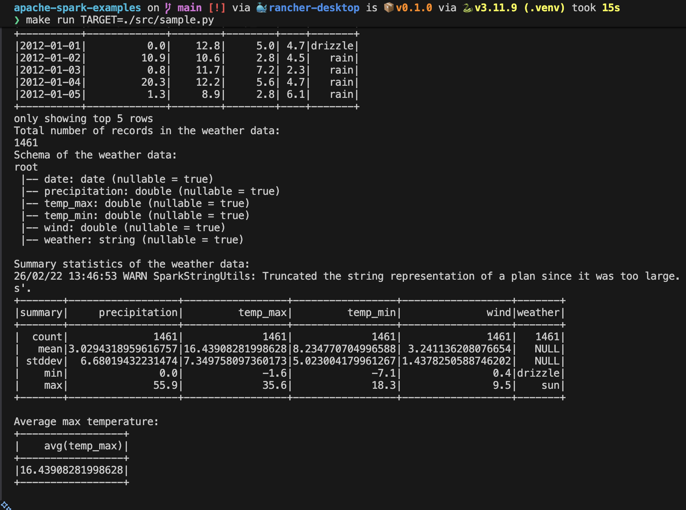

# apache-spark-examples

> To read how apache spark works, go to [./documentation/intro.md](./documentation/intro.md)

## To run examples:
- Open Terminal in `<repo-root>`
- run command `make init` (it will create .venv, and installs poetry and other dependencies)
- to run a python file
  - run command `make run TARGET=<PATH_TO_PYTHON_FILE>` e.g. `make run TARGET=./src/sample.py`
  - Or, run command `poetry run python PATH_TO_PYTHON_FILE` e.g. `poetry run python ./src/sample.py`

## Running Spark Local Kubernetes cluster like Rancher Desktop
[Running Spark locally](./documentation/deployment/deployment.md#for-rancher-desktop-local-development)

> The result of your job will be visible in the logs of your spark-driver, 
> Or you can also check in port 4040 of spark-driver container

## Running Spark on Kubernetes
[How to build and deploy to a remote Kubernetes cluster](./documentation/deployment/deployment.md#for-remote-kubernetes-cluster)

[Running Spark on Kubernetes](https://spark.apache.org/docs/latest/running-on-kubernetes.html)

> The result of your job will be visible in the logs of your spark-driver, 
> Or you can also check in port 4040 of spark-driver container

## Connect to Spark Connect server
[Launch Spark server with Spark Connect](https://spark.apache.org/docs/4.1.1/api/python/getting_started/quickstart_connect.html#Launch-Spark-server-with-Spark-Connect)

## Command Examples:
`make init`

---
`make run TARGET=./src/sample.py`

