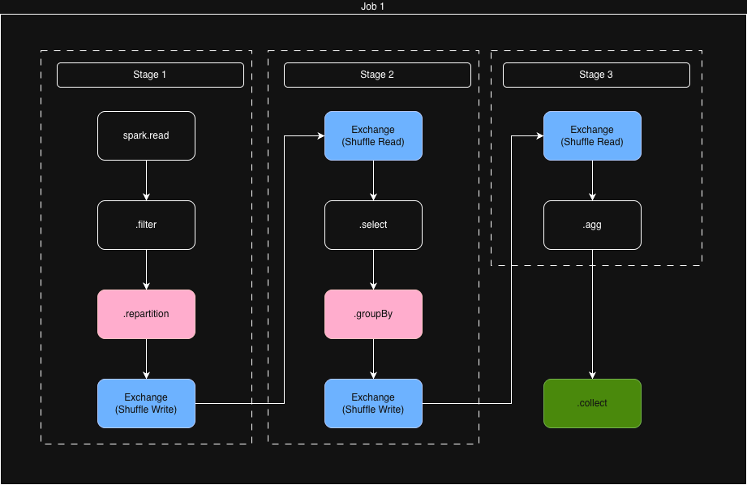

# Job, Stages and Tasks

In Apache Spark, based on the Transformations and Actions defined, a physical plan is converted into various **Jobs**, **Stages** and **Tasks**. These represent different levels of execution granularity in Spark’s execution model.

## Jobs

**Definition:**  
A **Job** in Apache Spark is the top‑level unit of work sent to the cluster for execution. A Job is created every time you invoke an **action** (e.g. `count()`, `collect()`, `save`, `show()`) on a DataFrame, Dataset, or RDD.

More concretely:

- A Job represents executing an optimized physical plan to produce the result of an action.
- One action call typically produces one Job (some complex scenarios may produce more than one).
- Each Job is broken down into one or more Stages, separated by shuffle boundaries.
- Jobs are visible in the Spark UI with their own Job ID, status, and metrics (duration, input size, shuffle read/write, etc.).

**Key points:**

- Triggered by an **action** (not by transformations alone).
- Operates over the full logical/physical plan built from all prior transformations.
- Can run independently of other jobs (but may reuse cached data).

## Stages

**Definition:**  
A **Stage** is a set of Tasks that can be executed in parallel without requiring data to be reshuffled between executors. Spark divides a Job into Stages based on **shuffle boundaries** in the physical plan.

There are typically two kinds of Stages:

- **Shuffle Map Stages** – produce intermediate shuffle data to be consumed by later stages (e.g. before `reduceByKey`, `groupBy`, `join`).
- **Result Stages** – produce the final output for an action (e.g. writing to storage or returning data to the driver).

**Key points:**

- A Job = one or more Stages.
- A new Stage is created whenever an operation requires a shuffle (e.g. `repartition`, `reduceByKey`, certain joins and groupings).
- Within a Stage, all Tasks run the same computation logic on different partitions.
- Stages are executed in a dependency order to respect upstream shuffle outputs.

## Tasks

**Definition:**  
A **Task** is the smallest unit of execution in Spark. A Task represents running the Stage’s computation on a **single partition** of the data on a single executor.

**Key points:**

- Each Stage is executed as many Tasks as there are partitions for that Stage’s input.
- All Tasks within a Stage perform the same operations, just on different partitions of the dataset.
- Tasks are scheduled by the driver to the available executors and can be retried on failure (Spark recomputes from lineage).
- A Task typically:
  - Reads its input partition (from memory, disk, or shuffle files),
  - Applies the chain of transformations defined for that Stage,
  - Produces either:
    - Intermediate shuffle files (for Shuffle Map Stages), or
    - Final output records (for Result Stages).

## Example

```python
# 1.a. Read data
df = spark.table("rock.prod.geography_test")

# 1.b. Narrow transformation
filtered = df.filter("region_code == 'EUR'")

# 1.c. Wide transformation (triggers a shuffle)
filtered = filtered.repartition(3)

# 2.a. Narrow transformation
projected = filtered.select("site_code", "pool_code", "is_operational")

# 2.b. Wide transformation (triggers a shuffle later)
projected = projected.groupBy("pool_code", "is_operational")

# 3.a. Narrow transformation
aggregated = projected.agg(F.count("site_code").alias("count")) 

# 4. Action (this triggers a Job)
result = aggregated.collect()
```


